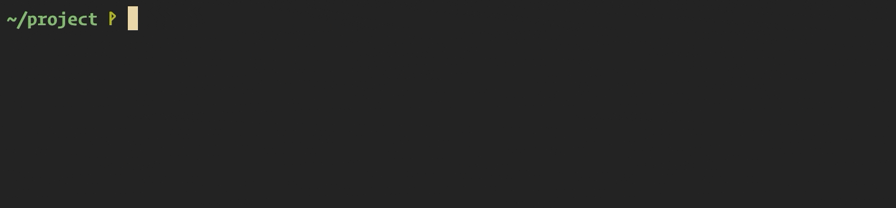

# dessert-cli

Dessert Command Line Tool (cli), written in Go using cobra and viper.



**Summary**
   * [License](#license)
   * [Installation](#installation)
   * [Installation for development](#installation-for-development)
   * [Commands](#commands)

## License

`dessert-cli` is an MIT-licensed software.

## Installation

Download the `dessert-cli` binary from our GitHub releases.

Add the binary to `/usr/local/bin`.

You are all set ! 🍰

## Installation for development

* build using go

```
go build
```

* connect to the GraphQL endpoint

The application must connect to a GraphQL endpoint in order to fetch
the needed data. By default, this is our current development endpoint.
However, one can override this by setting the `DESSERT_GRAPHQL_URI` environment
variable.


## Commands

### **init**

*Makes a folder dessert-ready.*

```bash
./dessert-cli init
```

Checks if package.json exists.

Else asks for an `npm init`

Adds to package.json:

- an object dessert
- the value "core_is" to this dessert object
- the keyword "dessert" to the keywords property

```
"dessert" : {
  "core_is": ""
}
"keywords": ["dessert"]
```

Creates a Dessert config file `dessert_config.yml`

```
version: 1
dessertToken: ""
```

### **login**

*Logs you into Dessert.*

```bash
./dessert-cli login
```

Your Dessert credentials will be prompted.

Grabs your token and writes it to `dessert_config.yml` for future actions.

### **logout**

[needs you to be logged in]

*Logs you out from the Dessert platform.*

```bash
./dessert-cli logout
```

### **publish**

[needs you to be logged in]

*Publishes your project to the Dessert plateform.*

```bash
./dessert-cli publish
```
 
You'll need to run `npm publish` afterwards.

### **replaces**

*Adds the modules you are replacing to your package.json.*

```bash
./dessert-cli replaces moduleA moduleB ...
```

### **version**

*Displays your `dessert-cli` version.*

```bash
./dessert-cli version
```